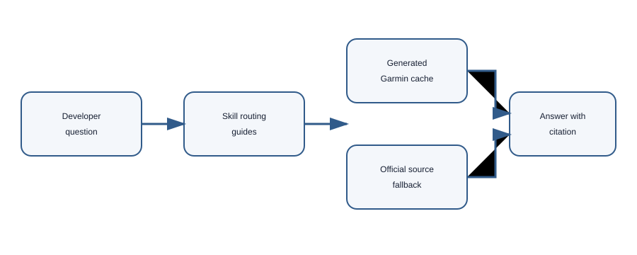
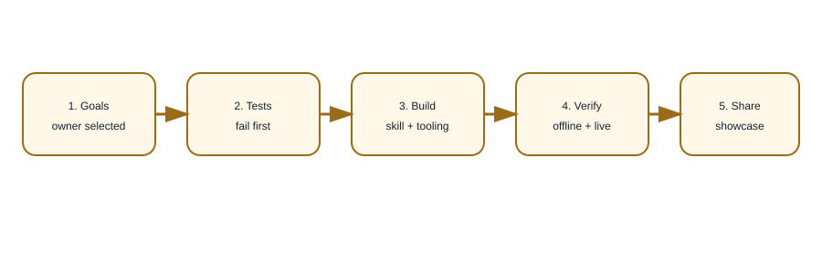

# Monkey C — Built with AI, for AI



Monkey C is a source-grounded Codex skill for Garmin Connect IQ development. It turns a language question, a Core Topics question, or a Toybox API question into a local-first answer path with official Garmin references close at hand.

## Live value

Ask questions such as:

- “How do I declare a Monkey C class and handle nullability?”
- “Which Core Topics explain device settings and app lifecycle?”
- “Which Toybox API should I use to read a sensor value?”

The skill routes each question to the smallest relevant local guide, searches the generated Garmin cache when available, and keeps the official page URL as the citation boundary. It is AI assisted, but the owner selected the goals, scope, sources, and verification criteria.

## Architecture



The repository contains the skill contract, human-readable routing guides, a deterministic synchronizer, an offline validator, and a safe installer. Generated Garmin pages live under `references/.generated/` locally and are intentionally ignored by Git.

## Creation timeline

1. Define the intended questions and source-page manifest.
2. Write failing repository contracts before implementation.
3. Add routing guides for Monkey C, Core Topics, and the Toybox API.
4. Build synchronization, validation, and installation scripts.
5. Document the AI-assisted workflow and publish a reproducible showcase.

## Evidence

<!-- validation-summary:start -->
- 9 Monkey C pages, 45 Core Topics pages, and 3 API seed pages are tracked in the expected-page manifest.
- The live synchronization fixture verified 391 files, including 384 HTML pages, with 0 missing pages, 0 broken local links, and 0 duplicate paths.
- The repository contract suite reached 155 assertions before the showcase layer.
<!-- validation-summary:end -->

The exact evidence is regenerated by the test and synchronization scripts; it is not a claim that generated documentation is committed to this repository.

The forward-validation prompts and expected routes are recorded in [tests/forward-test.md](tests/forward-test.md).

## Try it

Clone the repository and install the skill into your Codex skills directory:

```powershell
pwsh -File scripts/install.ps1 -CodexHome "$HOME/.codex" -Sync
```

To refresh the local Garmin cache later:

```powershell
pwsh -File scripts/sync-docs.ps1
pwsh -File scripts/validate-docs.ps1
```

Read the [installation guide](docs/installation.md), [usage guide](docs/usage.md), and [reference routing guide](docs/reference-routing.md) for the complete path. The design is captured in the [case study](docs/case-study.md) and [AI workflow](docs/ai-workflow.md).

## Learn from it

This is a showcase of how an AI-assisted repository can remain inspectable: the owner chose the goals, tests express the acceptance criteria, sources are fetched through a repeatable script, and legal boundaries are explicit. Start with the [case study](docs/case-study.md), then inspect the [implementation plan](docs/superpowers/plans/2026-09-21-monkey-c-skill.md) and the repository tests.

Official source families:

- [Monkey C](https://developer.garmin.com/connect-iq/monkey-c/)
- [Core Topics](https://developer.garmin.com/connect-iq/core-topics/)
- [Connect IQ API documentation](https://developer.garmin.com/connect-iq/api-docs/)

The Garmin documentation remains Garmin's content. This repository stores routing metadata and local generated copies only for the user's approved development workflow; see [legal and attribution](docs/legal.md).
